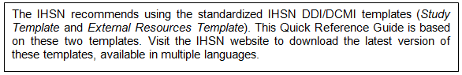

================
Completing metadata
================

The IHSN Toolkit (version 1.n) makes use of the Data Documentation Initiative (DDI Version 2) and the Dublin Core (DCMI version X) metadata standards. 

A thorough completion of the DDI and DCMI elements will significantly raise the value of the archiving work by providing users with the necessary information to put the study into its proper context and to understand its purpose. 

The DDI requires completion of the following sections: Document Description, Study Description, Data Files Description, Variables Description, and External Resources Description. Recommendations for each field included in the IHSN template are provided below. 

Overall recommendations:

*	As an archivist, you may need to seek assistance from key experts involved in some of the technical aspects of the survey. 
*	As a general rule, avoid using ALL CAPS when you fill DDI fields. Also, check the spelling of all entries. The Toolkit does not provide (yet) an automatic spell checker.
*	Some of the examples below present an optimal documentation of some fields. In many cases, for past surveys, you will not find such detailed information. Try to provide as much detail as possible. For future surveys, the information should be compiled and provided during the whole life cycle of the survey. This will ensure that the best possible documentation is available at completion of that survey.

**5.1.	Good practices for completing the Document Description**

Documenting a study using the DDI and DCMI metadata standards consists of generating a metadata file which will be saved in XML format in what is called an XML Document. The Document Description described below is a description of that XML file. The IHSN Template selected 5 elements to describe the DDI document.

**Study Title**

The title is the official name of the survey as it is stated on the questionnaire or as it appears in the design documents. The following items should be noted:

*	Include the reference year(s) of the survey in the title. 

*	Do not include the abbreviation of the survey name in the title.

*	As the survey title is a proper noun, the first letter of each word should be capitalized (except for prepositions or other conjunctions). 

*	Including the country name in the title is optional.

	Examples: 	
A. National Household Budget Survey 2002-2003
  
B. Popstan Multiple Indicator Cluster Survey 2002

**Metadata Producer**

Name of the person(s) or organization(s) who documented the dataset. Use the "role" attribute to distinguish different stages of involvement in the production process. 

Example:

**Name**

National Statistics Office (NSO)

**Role**

Documentation of the study

**Name**

International Household Survey Network (IHSN)

**Role**

Review of the metadata

**Date of Production**

This is the date (in ISO format YYYY-MM-DD) the DDI document was produced (not distributed or archived). This date will be automatically imputed when you save the file.

**5.2.	Good practices for completing the Study Description**

In the DDI standard, the Study Description is the section that contains all elements needed to describe the study itself (investigators, dates and methods, scope and coverage, etc.) 

**5.3.	Good practices for completing the File Description**

The File Description is the DDI section that aims to provide a detailed description of each data file. The IHSN has selected six of the available DDI elements.

[Table]

**5.4.	Good practices for completing the Variables Description**

The Variable Description is the section of the DDI document that provides detailed information on each variable.

[Table]

**5.5.	Good practices for completing the External Resources description**

The External Resources are all materials related to the study others than the data files. They include documents (such as the questionnaires, interviewer’s manuals, reports, etc), programs (data entry, editing, tabulation, and analysis), maps, photos, and others. To document external resources, the IHSN Toolkit uses the Dublin Core metadata standard (which complements the DDI standard).

[Table]
