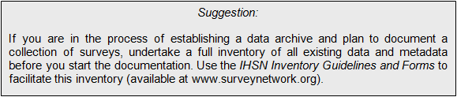

================
Gathering and preparing the dataset
================

Gathering and preparing data requires great care. Various versions of the data may have been produced. Before starting to document a dataset, it is important to ensure that you have the most appropriate version of all data files. If you are preparing a dataset for public release, you need the most final, edited, and anonymized version of the data. If you are documenting a dataset for archiving and internal use only, you may want to include the raw data (before editing), as well as the final, fully edited non-anonymized files. The Toolkit provides you with a possibility to document the specificity of each version of a dataset.

Much of the quality of the output generated by the Toolkit will depend upon the preparatory work. Although some changes in the data can be made in the Toolkit, it is highly recommended that the necessary checks and changes be made in advance using a statistical package. The following are recommended:

*	Preferably, organize your files in a hierarchical format (not in a flat format). Hierarchical files are easier to analyze (as they contain less variables to store the same information), and are more efficient in terms of data storage (smaller files).
Flat file:
 

Hierarchical file:
 

 
*	If a dataset contains multiple related files, each record in each file must have a unique identifier. This identifier may be made of one or multiple variables. These identifiers are also called “key variables”, as they are used by statistical packages such as SPSS or Stata when data files need to be merged.  Identifiers must be composed of numeric variables only (some software applications, including the IHSN Toolkit, require that identifiers be numeric. The reason is that sorting and filtering records is much more efficient when variables are numeric). 

For the convenience of users of the data, avoid identifiers made of too many variables. For example, in a household survey, the household identifier will preferably be a single variable (which you may create by concatenating a group of variables ), and the individual identifier should be the combination of only two variables (the household ID, and the sequential number of each member).

If you prepare your data files for public dissemination, it may be preferable to generate a unique household identification that would not be a compilation of geographic codes (because geographic codes are highly identifying). In such case, it is recommended to generate an ID based on a sequential number.  

Example: Suppose the unique identification of a household is the combination of variables PROV (Province), DIST (District), EA (Enumeration Area), HHNUM (Household Number). The following options are possible:

Generate a concatenated ID	Option 3: 
Generate a sequential number
PROV	DIST	EA	HHNUM	HHID	HHID
12	01	014	004	1201014004	1
12	01	015	001	1201015001	2
13	07	008	112	1307008112	3
Etc	Etc	Etc	Etc	Etc	Etc

+-----------------------------------------+--------------------+--------------------+
| Option 1:                               | Option 2:          | Option 3:          |
| Use a combination of four variables	  | Generate a         | Generate a         |
|                                         | concatenated ID    | sequential number  |
+=========================================+====================+====================+
| .....                    | HHID               |           HHID     |
+-----------------------------------------+--------------------+--------------------+
| .....                    | 1201014004           |           1        |
+-----------------------------------------+--------------------+--------------------+
| .....                    | 1201015001           |           2 |
+-----------------------------------------+--------------------+--------------------+
| .....                    | 1307008112           |           3 |
+-----------------------------------------+--------------------+--------------------+
| .....                   | Etc          |           Etc|
+-----------------------------------------+--------------------+--------------------+

Options 2 and 3 are recommended. Note that if option 3 is chosen, it is crucial to preserve (but not distribute) a file that would provide the mapping between the original codes and the new HHID.
*	Make sure that, in all data files, the identification variable(s) provide a unique identifier. Use the duplicate function in SPSS or the isid command in Stata to verify this. 
*	If your dataset is hierarchical, carefully test the file relationships (using the merge command in SPSS and Stata). For a household survey for example, verify the all records in the individual-level files have a corresponding household in the household-level master file. Verify also that all households have at least one corresponding record in the household-roster file that lists all individuals.
*	Verify that the number of records in each file corresponds to what is expected. 
*	Do not include string variables if they can be converted into numeric variables. Statistical software is very inefficient when working with string variables. In Stata, the destring and the encode commands can be used to make such conversions.
*	Verify the completeness of your data files by comparing the content of these files with the survey questionnaire. Make sure that data from all sections of the questionnaire are included in the dataset.
*	Verify that all variables are labelled (variable labels), and that the codes for all categorical variables are labelled (value labels). The labels should be short but precise; a same label should not be used for two different variables.
*	For the convenience of the data users, include the relevant weighting coefficient variable(s) in all data files if possible.
*	Avoid repeating a same variable in multiple files unless there is a good reason for it (variables identifying the household, variables such as geographic codes, and weighting variables should be present in all files).  
*	Remove all unnecessary or temporary variables from the data files (the variables that present no interest for secondary users). To be useful, a derived variable must be documented.  For example, the filtering variables (“FILTER$”) generated by SPSS, or the _merge variable generated in Stata are not necessary in the files once the analysis is done. 
*	For sample surveys, verify that the variables identifying the various levels of stratification and the primary sample unit are included and easily identified in at least one of the data files. These variables are needed for the calculation of sampling errors.
*	Put the variables in a logic sequence (using the order command in Stata if needed or the “/KEEP=” option in SPSS when saving a file).
*	Generate descriptive statistics for all variables (frequencies for discrete variables; min/max/mean for continuous variables) and verify that these statistics look reasonable.
*	Compress the variables to reduce the file size; use the compress command in Stata, or the compress option when you save a SPSS data file. 
*	Sort records by their unique identifier before you save the file.

