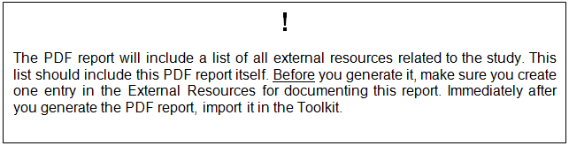

================
Generating the survey documentation in PDF
================

The Microdata Management Toolkit includes a useful tool for producing a PDF document summarizing all metadata entered in the Toolkit (see Tools > Study Documentation PDF). Generating this report is one of the final stages of properly preparing a survey for publication and dissemination. If previous versions exist and changes have been made to the data files or the metadata make sure you re-run the PDF generator. 

This report should be generated, saved and attached as an External Resource.

One thing to keep in mind is that in a survey with a large number of variables may produce a document that is very long. If the report is in excess of 300 or 350 pages, you may want to split this report (e.g., produce one report with the study metadata, and one with the files and variables metadata), or change the content options (e.g., not including a frequency table for all variables). 

