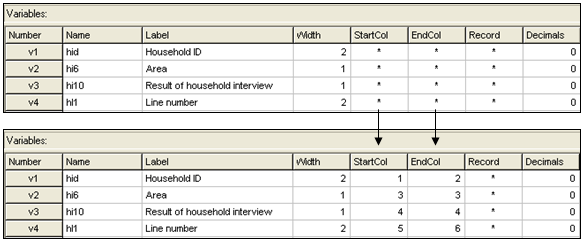
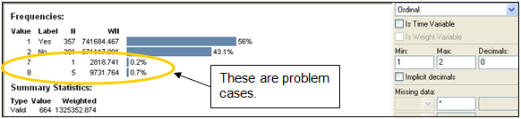
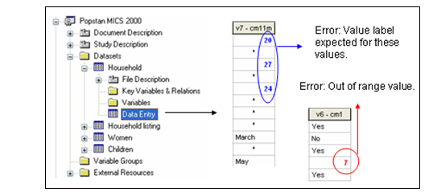

================
Importing data and establishing relationships
================

After all data and documentation files are gathered and checked, import the data files in the Toolkit. In the Microdata Management Toolkit, order the files in a logical fashion (e.g. sequentially through sections).

.. note::
	If you are documenting a population census and have very large data files, it is recommended to split the files by geographic area. Typically, you will have a file at individual level, one at the household level, and possibly one at the community level, for each State or Province. In such case, import all files for one State or Province only. You will import the other data files after you complete the documentation of the files. This will considerably reduce the time needed to save your files. The Toolkit will allow you to replicate the metadata from the documented files to all other data files that you will import later.

After all files are imported and ordered in a proper sequence, define the key variables for each data file. The base key variable(s) in a data file is (are) the variable(s) that provide the unique identifier of each record in that specific data file. 

Then establish the relations and validate them using the Tool > Validate Relationships in the Toolkit. This automatic validation is a way to check the structural integrity of the identifier variables and assure there are no duplicates in the data. 

.. topic::

**Establishing relationships – An example**

In this example, we assume that the dataset is obtained from a household budget survey and comprises:
•	A household-level file "hhld.dat" with the household characteristics (one record per household). Each household is identified by a variable named hhid.
•	An individual-level file "ind.dat" with variables related to each member of the household (one record per person). Each household member is identified by the combination of variables hhid and memno.
•	A consumption data file "cons.dat", with one record per item (goods and services) per household. Each record is uniquely identified by the combination of variables hhid and itemno. The file also contains a variable district identifying the district where the household resides.
•	A data file "prices.dat" with average price per commodity, per district (one record per item per district). Each record is uniquely identified by variables district and itemno.

.. image:: images/er_exmaple.png

In the IHSN Toolkit, these relationships will be established as follows in the “Key variables and relationships” section of each data file:

.. image:: images/er_exmaple1.png

If you have imported your data from any format other than fixed ASCII, re-sequence the data using the Variables > Resequence option in the Toolkit. This re-sequencing tool will automatically fill the "StartCol" and "EndCol" columns in the variable description section. This must be done for each data file.

Before going further, quickly browse all variables in all data files to visually check the frequencies. This will allow you to easily spot some outliers or invalid codes, which will require recoding (which can be done in the Toolkit or in the source data files which will then have to be re-imported).

Last, view the content of each data files in the "Data Entry" page. All data should be displayed in black fonts. Data displayed in bold red indicate out of range values. Data in bold blue fonts indicate that value labels are missing for that variable. 

Save the file. The Toolkit saves all data files and the information you already added (on key relationships, etc) in one single file (Nesstar format). We recommend you save this file in the survey root directory, using the survey abbreviation, year and version number as file name (e.g., HIES2007_v11). Note that it is good practice to avoid using spaces in a file name (use underscore characters instead).
