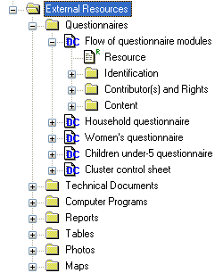
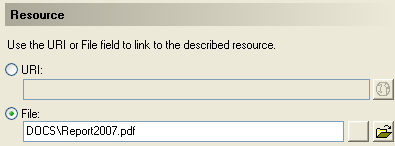

================
Importing external resources 
================

Before importing your external resources, create folders in the Toolkit as necessary (these are directories in the External Resources section in the Toolkit, not new directories on your hard drive). If you have very few external resources, all resources can be listed in the root directory. If you have many, organize them by type of resources (in the example below, we have created separate directories for the Questionnaires, Technical Documents, Computer Programs, Reports, Tables, Photos and Maps). 
Create an entry for each resource by entering a label in the Resource Information field. This label should be short but explicit. Then identify the resource file in the "Resource" field. The field "Resource" is used to indicate the filename or URL location (website) of the external resource. The resource consists of the filename, and a relative path (relative to the directory where your study Nesstar file is saved). The reason for entering a relative path is that it will allow you to move the whole study directory and its subdirectories to another location or another drive, without having to re-enter the location of the files.

Example: 

Let’s assume your study is a household budget survey conducted in 2007. If you followed the recommendations made in the introductory chapter "Before you start – Organizing your files", you will have created a directory like C:\\HIES2007. Your nesstar file will be saved as HIES2007.Nesstar in this directory. Suppose also that a document titled Report2007.pdf is saved in a directory C:\\HIES2007\\DOCS. When you fill the resource field in the External Resources page, do NOT enter "C:\\HIES2007\\DOCS\\Report2007.pdf. Enter the file name as follows: 

Some resources might be composed of more than one file (for example, the CSPro data entry application includes multiple files that should not be separated). In such cases, zip them into one single file, and import it as a single resource.

For documents available in multiple formats (for example, a questionnaire available in Excel and in PDF), you may create two separate resources, or zip the files into one single file. In such case, list the different formats available in the "Content/Description" field.
